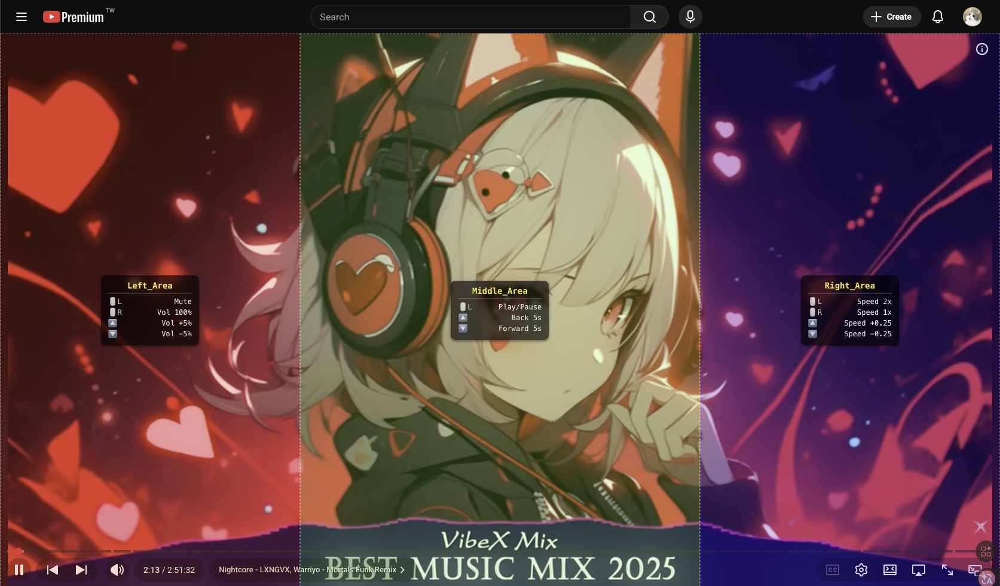

# YouTube Mouse Master

An interaction enhancement script for the YouTube player designed for power users. This is a deeply optimized, zero-overlay, and highly customizable Tampermonkey script.

## ✨ Key Features

* **Quick Controls**: Set custom action zones on the player that correspond to mouse actions such as clicks and wheel scrolls to quickly adjust volume, speed, progress, etc.

* **Custom Action Zones**: Supports highly customizable sensor zone settings, allowing you to freely adjust zone size and position (default provides Left, Middle, and Right zone configurations).

* **Zero-Overlay Interaction**: Abandons traditional transparent layer overlays and uses high-performance coordinate calculations, ensuring no interference with native UI clicks like progress bars and buttons.

* **Mac / High-Frequency Wheel Optimization**: Built-in filtering mechanism perfectly adapts to MOS, SmoothScroll, or Mac trackpads, preventing over-sensitive jumps during operation.

## ⚙️ Customizable Parameters

You can adjust settings directly in the `SETTINGS` and `CONFIG` blocks at the top of the script.

### Global Settings

| Parameter | Description | Default |
| :--- | :--- | :--- |
| `DEBUG` | Whether to output debug messages to the Console | `false` |
| `ZONE_TOGGLE_KEY` | Hotkey to toggle zone visibility | `F9` |
| `OSD_DURATION` | How long OSD prompts stay on screen (ms) | `800` |
| `OSD_FADE_OUT` | Duration of OSD fade-out animation (ms) | `150` |
| `OSD_FONT_SIZE` | Font size of OSD prompt text (supports px, em, rem, etc.) | `28px` |
| `USE_WHEEL_COUNT_FIXED` | Whether to enable fixed wheel count filtering (Recommended for Mac users) | `true` |
| `WHEEL_DELAY` | Debounce delay time for wheel events (ms) | `1` |
| `WHEEL_COUNT_THRESHOLD` | Wheel count trigger threshold: how many wheel events to accumulate before performing an action | `14` |

### Custom Zone Configuration

You can fully customize action zones according to your personal needs, adjusting zone size and position.

Default provides Left, Middle, and Right zone configurations:

| Zone | Left Click | Right Click | Wheel Action |
| ----- | ----- | ----- | ----- |
| **Left (Volume)** | Quick Mute (0%) | Max Volume (100%) | Volume Step +/- 5% |
| **Middle (Progress)** | Pass-through (Native Play/Pause) | Pass-through (Native Menu) | Seek +/- 5s |
| **Right (Speed)** | Quick 2.0x | Reset 1.0x | Speed Step +/- 0.25x |

### Supported Actions List

In `mouse_action`, the `action` types you can use are as follows:

| Action Name (action) | Description | Example Parameter (value) |
| :--- | :--- | :--- |
| `volume_up` | Increase volume | `5` (represents +5%) |
| `volume_down` | Decrease volume | `5` (represents -5%) |
| `volume_set` | Set fixed volume | `0` (Mute) or `100` (Max) |
| `volume_mute` | Toggle mute / unmute | No parameter needed |
| `seek` | Jump progress | `5` (forward) or `-5` (backward) |
| `toggle_play_pause` | Toggle play / pause status | No parameter needed |
| `speed_up` | Increase playback rate | `0.25` |
| `speed_down` | Decrease playback rate | `0.25` |
| `speed_set` | Set fixed playback rate | `1.0`, `2.0`, etc. |
| `none` | Perform no action | Passes the event through to YouTube's native handling |

## 📦 Installation

1. Install the browser extension: [Tampermonkey](https://www.tampermonkey.net/).

2. Click "Create a new script".

3. Copy and paste the contents of `YouTubeMouseMaster.user.js`.

4. Save and open YouTube to enjoy the ultimate interaction!

## 🛠 Debug Mode

If you want to confirm the sensor zone range, set `SHOW_ZONES` to `true` in the script. Semi-transparent colored blocks will appear on the player to help you adjust the proportions to your liking.